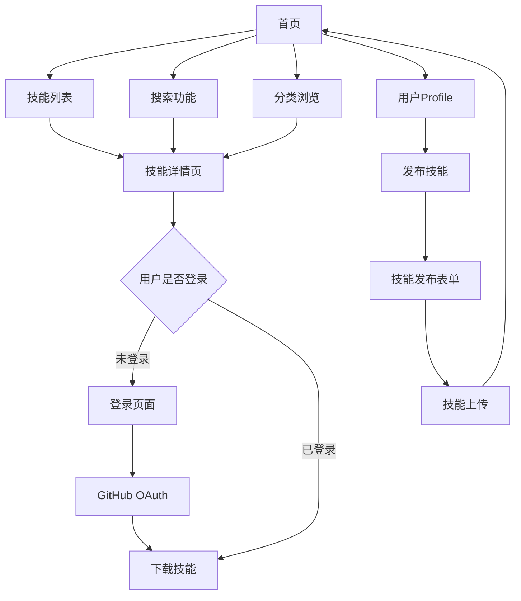

## 1. 产品概述
Skills Hub是一个技能分享平台，允许用户发布、搜索和下载各种技能资源。通过GitHub登录系统，用户可以上传自己的技能作品，其他用户可以浏览、搜索并下载感兴趣的技能内容。

目标用户包括技能分享者、学习者和技术爱好者，为他们提供一个集中的技能资源交流平台。

## 2. 核心功能

### 2.1 用户角色
| 角色 | 注册方法 | 核心权限 |
|------|----------|----------|
| 访客用户 | 无需注册 | 浏览技能、搜索技能、查看技能详情 |
| 认证用户 | GitHub OAuth登录 | 下载技能、发布技能、管理个人Profile |

### 2.2 功能模块
我们的Skills Hub需求包含以下主要页面：
1. **首页**: Banner介绍、技能搜索、技能分类展示、技能列表
2. **技能详情页**: 技能详细信息、下载功能、相关技能推荐
3. **技能发布页**: 技能信息填写、文件上传、分类选择
4. **用户Profile页**: 个人信息展示、发布的技能管理
5. **教程页**: 使用指南、平台介绍
6. **关于我们页**: 团队信息、联系方式
7. **登录页**: GitHub OAuth登录入口

### 2.3 页面详情
| 页面名称 | 模块名称 | 功能描述 |
|-----------|-------------|-------------|
| 首页 | Banner区域 | 展示Skills Hub平台介绍，包含平台价值和核心功能说明 |
| 首页 | 搜索模块 | 提供关键词搜索框，支持实时搜索建议和搜索结果展示 |
| 首页 | 分类展示 | 按技能类型分类展示，支持分类筛选和浏览 |
| 首页 | 技能列表 | 展示技能卡片，包含技能名称、简介、作者、下载次数等信息 |
| 技能详情页 | 技能信息 | 展示技能详细介绍、使用说明、技术栈、版本信息等 |
| 技能详情页 | 下载功能 | 提供技能文件下载，需要登录后才能下载 |
| 技能详情页 | 相关推荐 | 展示同类别或相关的其他技能 |
| 技能发布页 | 表单填写 | 输入技能名称、描述、分类、技术栈、版本等信息 |
| 技能发布页 | 文件上传 | 上传技能相关的文件或代码包 |
| 用户Profile页 | 个人信息 | 展示GitHub头像、用户名、个人简介等 |
| 用户Profile页 | 技能管理 | 展示用户发布的所有技能，支持编辑和删除 |
| 教程页 | 使用指南 | 提供平台使用教程和最佳实践 |
| 关于我们页 | 团队介绍 | 展示开发团队信息和联系方式 |
| 登录页 | GitHub登录 | 提供GitHub OAuth登录入口 |

## 3. 核心流程

#### 访客用户流程
用户访问首页 → 浏览技能列表和分类 → 点击技能查看详情 → 尝试下载时提示登录 → 跳转到GitHub登录 → 登录成功后返回详情页下载技能

#### 认证用户流程
用户登录 → 进入个人Profile → 点击发布新技能 → 填写技能信息并上传文件 → 提交审核 → 技能发布成功 → 在首页展示

## 4. 用户界面设计

### 4.1 设计风格
- **主色调**: 深蓝色 (#1e40af) 作为主色，白色背景，灰色辅助
- **按钮样式**: 圆角设计，主要操作为实心按钮，次要操作为边框按钮
- **字体**: 英文字体使用Inter，中文字体使用PingFang SC，标题18-24px，正文14-16px
- **布局风格**: 卡片式布局，顶部固定导航栏，响应式网格系统
- **图标风格**: 使用简洁的线性图标，统一线条粗细

### 4.2 页面设计概述
| 页面名称 | 模块名称 | UI元素 |
|-----------|-------------|-------------|
| 首页 | Banner区域 | 全宽背景图，标题文字居中，CTA按钮，渐变遮罩效果 |
| 首页 | 搜索模块 | 圆角搜索框，搜索图标，自动完成下拉框，宽度占屏幕60% |
| 首页 | 技能卡片 | 卡片阴影悬停效果，包含技能图标、标题、简介、标签、下载按钮 |
| 技能详情页 | 头部信息 | 技能标题、作者信息、发布时间、下载统计 |
| 技能详情页 | 内容区域 | 左侧技能详情，右侧作者信息和相关推荐 |
| 用户Profile页 | 个人信息 | GitHub头像圆形显示，用户名加粗，个人简介 |
| 技能发布页 | 表单布局 | 两列布局，左侧基本信息，右侧文件上传区域 |

### 4.3 响应式设计
- **桌面优先**: 基础设计为桌面端，最大宽度1200px
- **移动端适配**: 支持平板和手机端，使用媒体查询适配不同屏幕
- **触摸优化**: 按钮和交互元素适合触摸操作，最小点击区域44px
- **断点设置**: 768px (平板), 480px (手机)