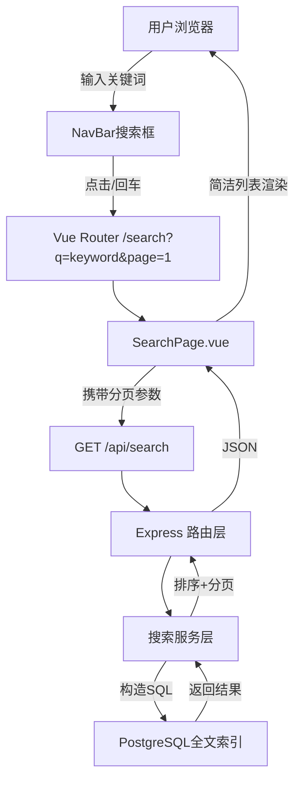

# 技术架构文档：后端搜索方案（方案B）

## 1. 架构设计



## 2. 技术描述

* **前端**：Vue3 + TypeScript + Vue Router + TailwindCSS

* **后端**：Node.js + Express\@4 + TypeScript

* **数据库**：PostgreSQL（Supabase）

* **全文搜索**：PostgreSQL GIN索引 + `to_tsvector`权重排序

* **限流**：express-rate-limit（100 req/15min/IP）

* **安全**：参数化查询 + zod校验 + 关键词长度限制（2-30字符）

## 3. 路由定义

| 路由                | 说明                         |
| ----------------- | -------------------------- |
| `GET /api/search` | 搜索技能，支持分页、模糊查询、权重排序        |
| `GET /search`     | 前端搜索结果页，参数：`q`关键词，`page`页码 |

## 4. API设计

### 4.1 搜索接口

```http
GET /api/search?q=keyword&page=1&pageSize=20
```

**Query参数**（zod校验）

| 字段       | 类型     | 必填 | 说明             |
| -------- | ------ | -- | -------------- |
| q        | string | 是  | 搜索关键词，2-30字符   |
| page     | number | 否  | 页码，默认1         |
| pageSize | number | 否  | 每页条数，默认20，最大50 |

**响应200**

```json
{
  "list": [
    {
      "id": "uuid",
      "title": "xxx",
      "description": "xxx",
      "tags": ["xxx"],
      "author_name": "xxx",
      "download_count": 123,
      "created_at": "2025-01-01T00:00:00Z"
    }
  ],
  "total": 42,
  "page": 1,
  "pageSize": 20
}
```

**错误码**

| 状态码 | 场景       |
| --- | -------- |
| 400 | 关键词过短/过长 |
| 429 | 触发限流     |
| 500 | 数据库异常    |

## 5. 数据库设计

### 5.1 索引优化

```sql
-- 全文搜索GIN索引（权重：标题A、描述B、标签C）
CREATE INDEX idx_skills_search ON skills
USING GIN (to_tsvector('simple',
  title || ' ' ||
  description || ' ' ||
  coalesce(array_to_string(tags, ' '), '')
));

-- 分页优化（order by + limit）
CREATE INDEX idx_skills_created_at ON skills(created_at DESC);
```

### 5.2 搜索SQL（参数化）

```sql
SELECT id, title, description, tags, author_name, download_count, created_at
FROM skills
WHERE to_tsvector('simple', title||' '||description||' '||coalesce(array_to_string(tags,''),''))
      @@ plainto_tsquery('simple', $1)
ORDER BY ts_rank_cd(to_tsvector('simple', title||' '||description||' '||coalesce(array_to_string(tags,''),'')), plainto_tsquery('simple', $1)) DESC,
         created_at DESC
LIMIT $2 OFFSET $3;
```

## 6. 前端实现

### 6.1 NavBar搜索框（组件片段）

```vue
<template>
  <form @submit.prevent="goSearch" class="flex items-center gap-2">
    <input
      v-model="keyword"
      type="search"
      placeholder="搜索技能..."
      maxlength="30"
      class="w-48 px-3 py-1.5 text-sm border rounded-md focus:outline-none focus:ring-2 focus:ring-orange-500"
    />
    <button type="submit" class="px-3 py-1.5 text-sm bg-orange-600 text-white rounded hover:bg-orange-700">搜索</button>
  </form>
</template>

<script setup lang="ts">
import { ref } from 'vue'
import { useRouter } from 'vue-router'

const keyword = ref('')
const router = useRouter()

const goSearch = () => {
  const q = keyword.value.trim()
  if (q.length < 2) return
  router.push({ name: 'SearchPage', query: { q, page: 1 } })
}
</script>
```

### 6.2 SearchPage.vue（简洁列表）

```vue
<template>
  <div class="max-w-4xl mx-auto p-6">
    <h1 class="text-xl font-bold mb-4">搜索结果：{{ route.query.q }}</h1>
    <div v-if="loading" class="text-gray-500">加载中…</div>
    <div v-else-if="!list.length" class="text-gray-500">暂无结果</div>
    <ul v-else class="space-y-3">
      <li v-for="item in list" :key="item.id" class="border rounded p-3 hover:shadow">
        <router-link :to="`/skill/${item.id}`" class="block">
          <div class="font-semibold text-gray-900">{{ item.title }}</div>
          <div class="text-sm text-gray-600 mt-1">{{ item.description }}</div>
          <div class="flex items-center gap-2 mt-2 text-xs text-gray-500">
            <span>{{ item.author_name || '官方' }}</span>
            <span>下载 {{ item.download_count }}</span>
            <span>{{ dayjs(item.created_at).format('YYYY-MM-DD') }}</span>
          </div>
        </router-link>
      </li>
    </ul>
    <Pagination v-if="total > pageSize" :total="total" :page="page" :page-size="pageSize" @change="goPage" />
  </div>
</template>

<script setup lang="ts">
import { ref, onMounted, watch } from 'vue'
import { useRoute, useRouter } from 'vue-router'
import { getSearch } from '@/api/search'
import dayjs from 'dayjs'

const route = useRoute()
const router = useRouter()

const list = ref([])
const total = ref(0)
const page = ref(1)
const pageSize = 20
const loading = ref(true)

const fetch = async () => {
  loading.value = true
  const q = String(route.query.q || '').trim()
  const p = Number(route.query.page || 1)
  if (!q) return
  const { data } = await getSearch({ q, page: p, pageSize })
  list.value = data.list
  total.value = data.total
  page.value = p
  loading.value = false
}

const goPage = (p: number) => {
  router.replace({ query: { ...route.query, page: p } })
}

onMounted(fetch)
watch(() => route.query, fetch)
</script>
```

### 6.3 API调用封装

```ts
// src/api/search.ts
import axios from 'axios'

export interface SearchParams {
  q: string
  page?: number
  pageSize?: number
}

export interface SearchItem {
  id: string
  title: string
  description: string
  tags: string[]
  author_name: string | null
  download_count: number
  created_at: string
}

export interface SearchResult {
  list: SearchItem[]
  total: number
  page: number
  pageSize: number
}

export const getSearch = (params: SearchParams): Promise<{ data: SearchResult }> =>
  axios.get('/api/search', { params })
```

## 7. 性能优化

| 维度      | 方案                                          |
| ------- | ------------------------------------------- |
| **数据库** | GIN索引 + 预排序（权重+时间）                          |
| **缓存**  | Redis缓存热点关键词（TTL 5min）                      |
| **分页**  | 深分页使用`keyset`（`WHERE created_at < $cursor`） |
| **限流**  | IP级100次/15min，避免刷接口                         |
| **字段**  | 仅SELECT需要的列，减少IO                            |

## 8. 安全考量

> **SQL注入**：使用参数化查询（`$1,$2`），禁止字符串拼接。\
> **XSS**：关键词入库存储不转义，前端输出使用`{{ }}`默认转义。\
> **限流**：express-rate-limit + 关键词长度校验（2-30字符）。\
> **权限**：搜索接口允许匿名，不暴露敏感字段（如`user_id`）。

## 9. 部署与监控

* **日志**：记录关键词、耗时、结果数，便于后续调优。

* **指标**：

  * QPS、P99延迟

  * 缓存命中率

  * 慢查询（>200ms）

* **报警**：P99 > 500ms 或错误率 > 1% 时触发。

***

> 本方案已覆盖分页、模糊查询、权重排序、安全防护与性能优化，可直接落地。

