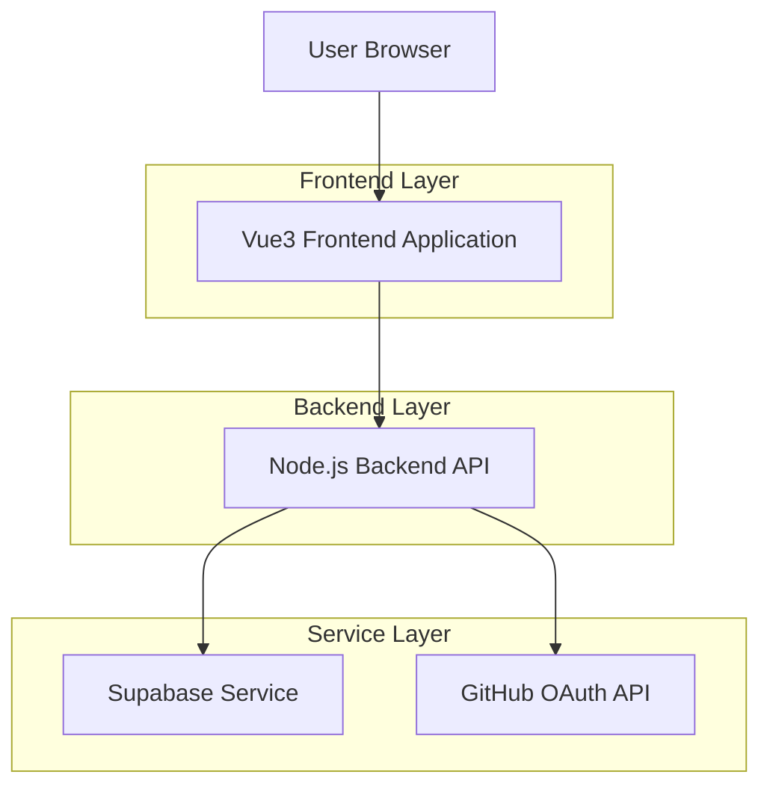
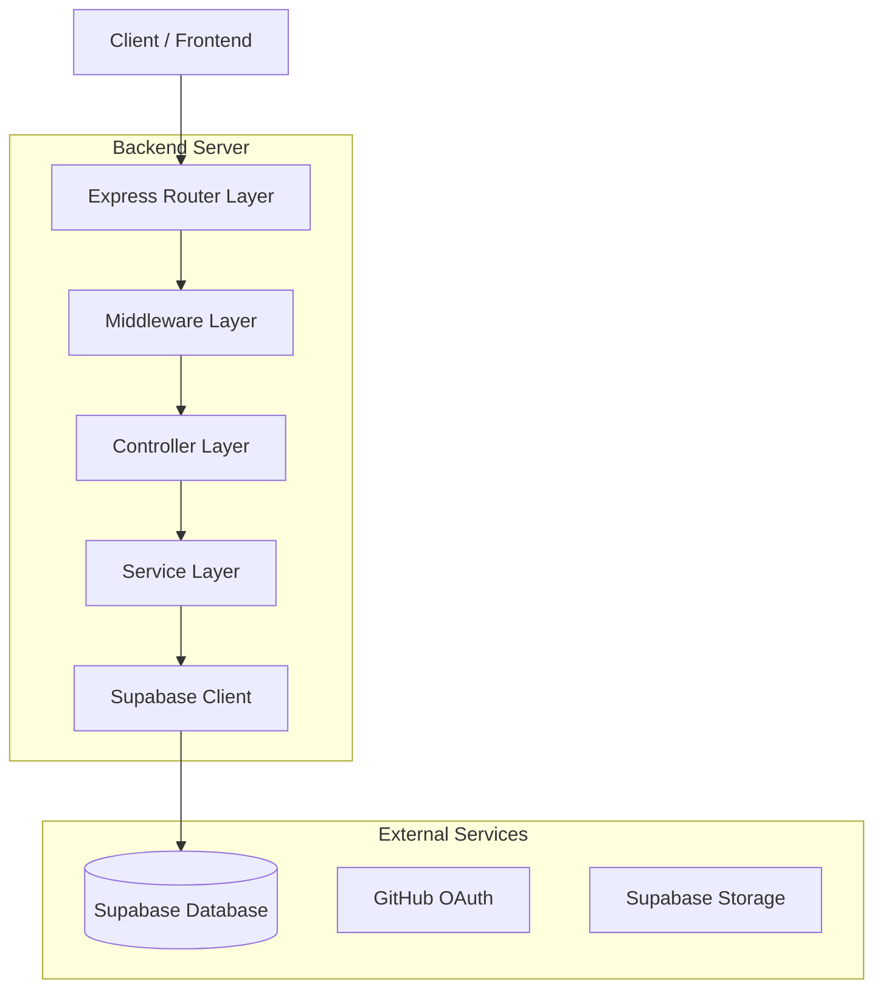
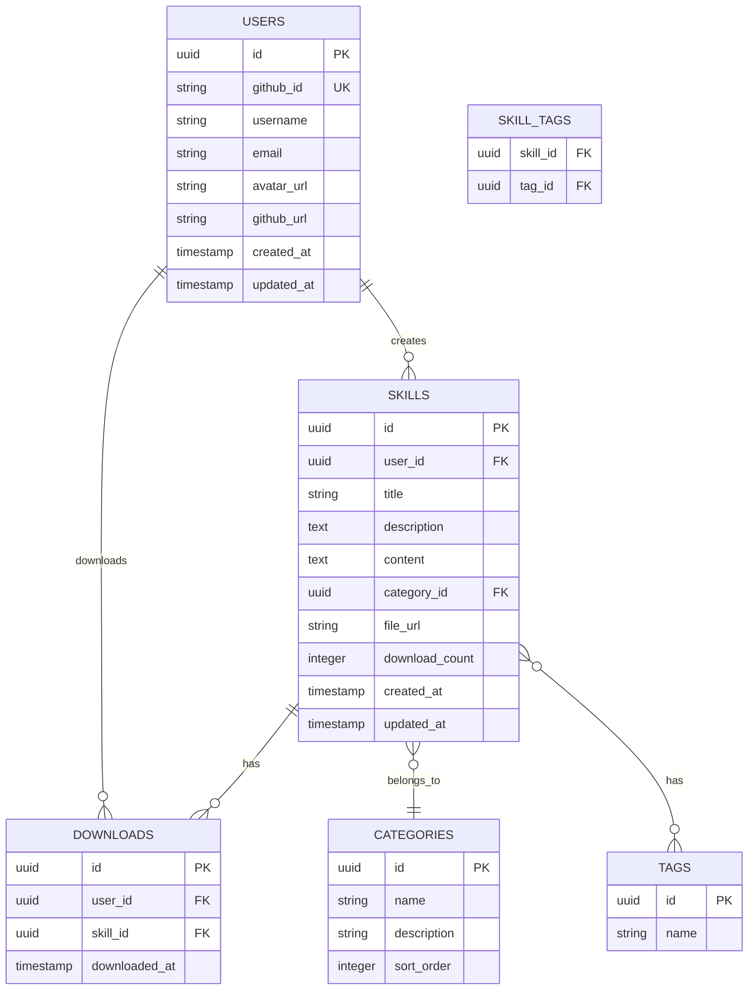

## 1. 架构设计



## 2. 技术描述

* **前端**: Vue3\@3.3 + TypeScript\@5 + Vite\@4 + TailwindCSS\@3

* **初始化工具**: vite-init

* **后端**: Node.js\@18 + Express\@4 + TypeScript\@5

* **数据库**: Supabase (PostgreSQL)

* **认证**: Supabase Auth + GitHub OAuth

* **部署**: Vercel (前后端一体化部署)

## 3. 路由定义

| 路由             | 目的                  |
| -------------- | ------------------- |
| /              | 首页，展示技能列表和搜索功能      |
| /skills/:id    | 技能详情页，展示技能详细信息和下载   |
| /publish       | 技能发布页面，需要登录         |
| /profile       | 用户个人Profile页面，需要登录  |
| /tutorials     | 教程页面，展示使用指南         |
| /about         | 关于我们页面              |
| /login         | 登录页面，GitHub OAuth入口 |
| /auth/callback | GitHub OAuth回调地址    |

## 4. API定义

### 4.1 认证相关API

**GitHub登录**

```
GET /api/auth/github
```

重定向到GitHub OAuth授权页面

**OAuth回调**

```
GET /api/auth/callback
```

处理GitHub OAuth回调，创建用户会话

**用户登出**

```
POST /api/auth/logout
```

清除用户会话

### 4.2 技能相关API

**获取技能列表**

```
GET /api/skills
```

请求参数:

| 参数名      | 类型     | 必需    | 描述        |
| -------- | ------ | ----- | --------- |
| page     | number | false | 页码，默认1    |
| limit    | number | false | 每页数量，默认20 |
| category | string | false | 分类筛选      |
| search   | string | false | 搜索关键词     |

响应:

```json
{
  "data": [
    {
      "id": "uuid",
      "title": "技能标题",
      "description": "技能描述",
      "category": "编程",
      "tags": ["vue", "typescript"],
      "downloadCount": 100,
      "author": {
        "id": "user-uuid",
        "name": "用户名",
        "avatar": "头像URL"
      },
      "createdAt": "2024-01-01T00:00:00Z"
    }
  ],
  "total": 100,
  "page": 1,
  "limit": 20
}
```

**获取技能详情**

```
GET /api/skills/:id
```

响应:

```json
{
  "id": "uuid",
  "title": "技能标题",
  "description": "详细描述",
  "content": "技能内容",
  "category": "编程",
  "tags": ["vue", "typescript"],
  "downloadUrl": "下载链接",
  "downloadCount": 100,
  "author": {
    "id": "user-uuid",
    "name": "用户名",
    "avatar": "头像URL",
    "githubUrl": "GitHub链接"
  },
  "createdAt": "2024-01-01T00:00:00Z",
  "updatedAt": "2024-01-01T00:00:00Z"
}
```

**发布技能**

```
POST /api/skills
```

请求体:

| 参数名         | 类型     | 必需    | 描述    |
| ----------- | ------ | ----- | ----- |
| title       | string | true  | 技能标题  |
| description | string | true  | 技能描述  |
| content     | string | true  | 技能内容  |
| category    | string | true  | 技能分类  |
| tags        | array  | false | 技能标签  |
| file        | file   | false | 上传的文件 |

**下载技能**

```
GET /api/skills/:id/download
```

需要认证，记录下载次数

### 4.3 用户相关API

**获取用户信息**

```
GET /api/users/profile
```

需要认证

**获取用户发布的技能**

```
GET /api/users/:id/skills
```

## 5. 服务器架构图



## 6. 数据模型

### 6.1 数据模型定义



### 6.2 数据定义语言

**用户表 (users)**

```sql
-- 创建用户表
CREATE TABLE users (
  id UUID PRIMARY KEY DEFAULT gen_random_uuid(),
  github_id VARCHAR(50) UNIQUE NOT NULL,
  username VARCHAR(100) NOT NULL,
  email VARCHAR(255),
  avatar_url TEXT,
  github_url TEXT,
  created_at TIMESTAMP WITH TIME ZONE DEFAULT NOW(),
  updated_at TIMESTAMP WITH TIME ZONE DEFAULT NOW()
);

-- 创建索引
CREATE INDEX idx_users_github_id ON users(github_id);
CREATE INDEX idx_users_username ON users(username);
```

**技能表 (skills)**

```sql
-- 创建技能表
CREATE TABLE skills (
  id UUID PRIMARY KEY DEFAULT gen_random_uuid(),
  user_id UUID NOT NULL REFERENCES users(id) ON DELETE CASCADE,
  title VARCHAR(200) NOT NULL,
  description TEXT NOT NULL,
  content TEXT,
  category_id UUID NOT NULL REFERENCES categories(id),
  file_url TEXT,
  download_count INTEGER DEFAULT 0,
  created_at TIMESTAMP WITH TIME ZONE DEFAULT NOW(),
  updated_at TIMESTAMP WITH TIME ZONE DEFAULT NOW()
);

-- 创建索引
CREATE INDEX idx_skills_user_id ON skills(user_id);
CREATE INDEX idx_skills_category_id ON skills(category_id);
CREATE INDEX idx_skills_created_at ON skills(created_at DESC);
CREATE INDEX idx_skills_download_count ON skills(download_count DESC);
```

**分类表 (categories)**

```sql
-- 创建分类表
CREATE TABLE categories (
  id UUID PRIMARY KEY DEFAULT gen_random_uuid(),
  name VARCHAR(100) NOT NULL,
  description TEXT,
  sort_order INTEGER DEFAULT 0,
  created_at TIMESTAMP WITH TIME ZONE DEFAULT NOW()
);

-- 初始化分类数据
INSERT INTO categories (name, description, sort_order) VALUES
  ('编程开发', '编程相关的技能和工具', 1),
  ('设计创意', '设计、创意和视觉相关技能', 2),
  ('数据分析', '数据处理和分析技能', 3),
  ('产品运营', '产品管理和运营技能', 4),
  ('其他', '其他类型的技能', 5);
```

**标签表 (tags)**

```sql
-- 创建标签表
CREATE TABLE tags (
  id UUID PRIMARY KEY DEFAULT gen_random_uuid(),
  name VARCHAR(50) NOT NULL UNIQUE,
  created_at TIMESTAMP WITH TIME ZONE DEFAULT NOW()
);

-- 创建索引
CREATE INDEX idx_tags_name ON tags(name);
```

**技能标签关联表 (skill\_tags)**

```sql
-- 创建技能标签关联表
CREATE TABLE skill_tags (
  skill_id UUID NOT NULL REFERENCES skills(id) ON DELETE CASCADE,
  tag_id UUID NOT NULL REFERENCES tags(id) ON DELETE CASCADE,
  PRIMARY KEY (skill_id, tag_id)
);

-- 创建索引
CREATE INDEX idx_skill_tags_skill_id ON skill_tags(skill_id);
CREATE INDEX idx_skill_tags_tag_id ON skill_tags(tag_id);
```

**下载记录表 (downloads)**

```sql
-- 创建下载记录表
CREATE TABLE downloads (
  id UUID PRIMARY KEY DEFAULT gen_random_uuid(),
  user_id UUID NOT NULL REFERENCES users(id) ON DELETE CASCADE,
  skill_id UUID NOT NULL REFERENCES skills(id) ON DELETE CASCADE,
  downloaded_at TIMESTAMP WITH TIME ZONE DEFAULT NOW()
);

-- 创建索引
CREATE INDEX idx_downloads_user_id ON downloads(user_id);
CREATE INDEX idx_downloads_skill_id ON downloads(skill_id);
CREATE INDEX idx_downloads_downloaded_at ON downloads(downloaded_at DESC);
```

### 6.3 Supabase权限设置

```sql
-- 授予匿名用户基本读取权限
GRANT SELECT ON users TO anon;
GRANT SELECT ON skills TO anon;
GRANT SELECT ON categories TO anon;
GRANT SELECT ON tags TO anon;
GRANT SELECT ON skill_tags TO anon;

-- 授予认证用户完整权限
GRANT ALL PRIVILEGES ON users TO authenticated;
GRANT ALL PRIVILEGES ON skills TO authenticated;
GRANT ALL PRIVILEGES ON categories TO authenticated;
GRANT ALL PRIVILEGES ON tags TO authenticated;
GRANT ALL PRIVILEGES ON skill_tags TO authenticated;
GRANT ALL PRIVILEGES ON downloads TO authenticated;

-- 启用RLS (Row Level Security)
ALTER TABLE users ENABLE ROW LEVEL SECURITY;
ALTER TABLE skills ENABLE ROW LEVEL SECURITY;
ALTER TABLE downloads ENABLE ROW LEVEL SECURITY;

-- 创建RLS策略
-- 用户只能查看自己的详细信息
CREATE POLICY "用户查看自己的信息" ON users FOR SELECT
  USING (auth.uid() = id);

-- 用户可以查看所有技能
CREATE POLICY "查看所有技能" ON skills FOR SELECT
  USING (true);

-- 用户只能修改自己的技能
CREATE POLICY "用户修改自己的技能" ON skills FOR ALL
  USING (auth.uid() = user_id);

-- 用户只能查看自己的下载记录
CREATE POLICY "用户查看自己的下载" ON downloads FOR SELECT
  USING (auth.uid() = user_id);
```

