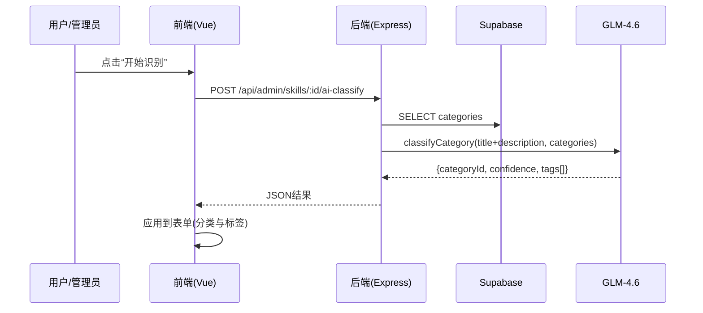
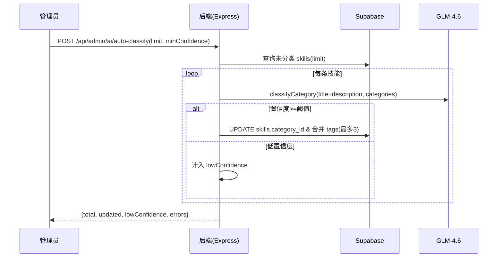

## 目标

* 生成一份《系统技术架构图》Markdown 文档，包含整体架构、关键模块、接口与数据流、批量自动化流程，采用 Mermaid 图表，便于团队查看与维护。

## 文档位置与命名

* 路径：`.trae/documents/系统技术架构图.md`

* 形式：Markdown + Mermaid（可在 IDE 或 Git 平台直接预览）。

## 图表清单（Mermaid）

1. 总体架构图（flowchart）

```mermaid
flowchart LR
  subgraph Frontend[Vite + Vue3 + TS]
    HP[HomePage.vue]
    SP[SkillsPage.vue]
    AdminViews[AdminSkills.vue 等]
    Pinia[Pinia Stores]
  end

  subgraph Backend[Express API]
    AdminRoutes[/api/admin/*]
    PublicRoutes[/api/*]
    AuthRoutes[/api/auth/*]
    VercelHandler[api/index.ts]
  end

  subgraph Data[Supabase]
    Tables[(skills, categories, user_profiles, users, feedback, link_exchange, user_favorites)]
    RPC[RPC/Views]
  end

  subgraph AI[GLM-4.6 Provider]
    AiService[api/utils/ai.ts]
  end

  Frontend -->|HTTP| Backend
  Backend -->|Service Role| Data
  Backend -->|JSON 输出| AI
```

1. 关键模块组件图（graph）

```mermaid
graph TD
  A[AdminSkills.vue] --> B[/api/admin/skills/:id/ai-classify]
  B --> C[AiService -> GlmProvider]
  C --> D[GLM-4.6 API]
  A --> E[/api/admin/skills]
  E --> F[(skills)]
```

1. 接口与数据流（sequence）



1. 批量自动化流程（sequence）



## 关键代码位置引用（将写入文档）

* Express 应用与入口：`api/app.ts:25-70`，`api/index.ts:7-13`

* 管理员鉴权：`api/routes/admin.ts:77-105`

* 管理登录：`api/routes/admin.ts:111-220`

* 分类路由：`api/routes/admin.ts:241-452`

* 技能路由：`api/routes/admin.ts:455-749,661-724,731-754,975-995`

* AI 封装：`api/utils/ai.ts:1-44`

* AI 单条识别：`api/routes/admin.ts`（/skills/:id/ai-classify）

* 批量识别：`api/routes/admin.ts`（/ai/auto-classify）

* 前端：`src/pages/HomePage.vue`、`src/pages/SkillsPage.vue`、`src/views/AdminSkills.vue`

## 维护建议

* 当新增模块或接口时，在同文档追加对应图节点与说明。

* 可选增加 C4 风格图（System/Container/Component）或导出 SVG/PDF。

## 执行

* 我将创建 `.trae/documents/系统技术架构图.md` 并写入上述内容（含 Mermaid 图与代码位置引用），提交到仓库。

