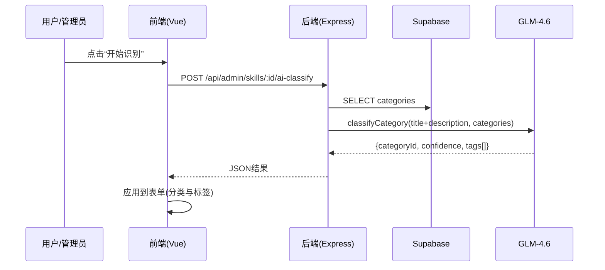
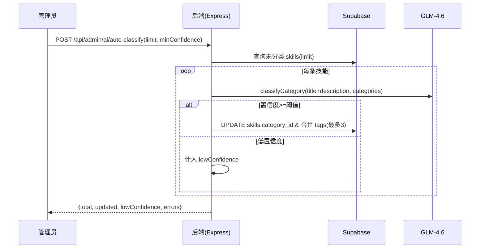

# 系统技术架构图

> 本文使用 Mermaid 绘制系统架构与流程图，支持在 IDE/Git 平台直接预览。

## 总体架构（Flowchart）
```mermaid
flowchart LR
  subgraph Frontend[Vite + Vue3 + TypeScript]
    HP[HomePage.vue]
    SP[SkillsPage.vue]
    AdminViews[AdminSkills.vue 等]
    Pinia[Pinia Stores]
  end

  subgraph Backend[Express API]
    AdminRoutes[/api/admin/*]
    PublicRoutes[/api/*]
    AuthRoutes[/api/auth/*]
    VercelHandler[api/index.ts]
  end

  subgraph Data[Supabase]
    Tables[(skills, categories, user_profiles, users, feedback, link_exchange, user_favorites)]
    RPC[RPC/Views]
  end

  subgraph AI[GLM-4.6 Provider]
    AiService[api/utils/ai.ts]
  end

  Frontend -->|HTTP| Backend
  Backend -->|Service Role| Data
  Backend -->|JSON 输出| AI
```

## 关键模块组件图（Graph）
```mermaid
graph TD
  A[AdminSkills.vue] --> B[/api/admin/skills/:id/ai-classify]
  B --> C[AiService -> GlmProvider]
  C --> D[GLM-4.6 API]
  A --> E[/api/admin/skills]
  E --> F[(skills)]
```

## 接口与数据流（Sequence）


## 批量自动化流程（Sequence）


## 关键代码位置引用（file_path:line_number）
- Express 应用与入口：`api/app.ts:25-70`，`api/index.ts:7-13`
- 管理员鉴权：`api/routes/admin.ts:77-105`
- 管理登录：`api/routes/admin.ts:111-220`
- 分类路由：`api/routes/admin.ts:241-452`
- 技能路由：`api/routes/admin.ts:455-749,661-724,731-754,975-995`
- AI 提供方封装：`api/utils/ai.ts:1-44`
- AI 单条识别：`api/routes/admin.ts`（/skills/:id/ai-classify）
- AI 批量识别：`api/routes/admin.ts`（/ai/auto-classify）
- 前端页面：`src/pages/HomePage.vue`、`src/pages/SkillsPage.vue`
- 管理端视图：`src/views/AdminSkills.vue`

## 技术要点摘要
- 前端：Vue3 + TypeScript + Pinia + Vue Router，响应式布局与固定行数显示策略（首页3行，技能页分页24项）。
- 后端：Express 路由、JWT 鉴权、容错降级（devStore），Vercel Functions 入口适配。
- 数据层：Supabase（Service Role Key 服务端访问）、物化视图/计数刷新与 RPC。
- AI：GLM-4.6 JSON 输出模式，结构化返回分类与标签（最多3个，差异化、去重），仅用标题+描述作为识别输入。
- 安全：Secrets 仅后端环境变量使用；不在前端和日志中暴露。

## 维护建议
- 新增模块/接口时同步更新图节点与说明。
- 可扩展 C4 风格图（System/Container/Component）；需要时导出 SVG/PDF。
```
